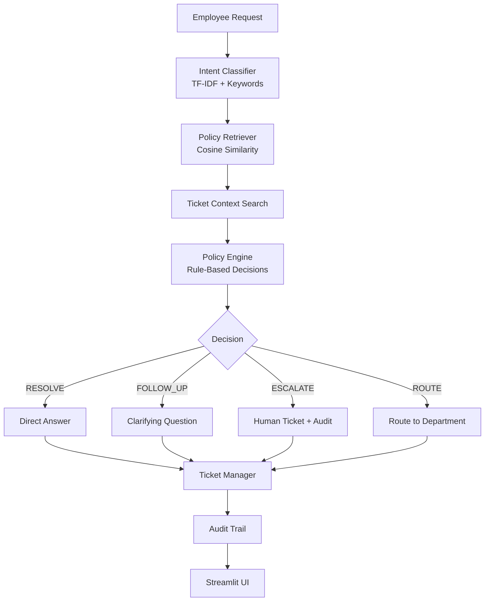

# Veridian IT Service Agent

> **AIONOS Agentic AI Factory Internship Assessment — Assignment 2: Internal Service Agent (IT Support)**

A complete, production-quality IT support agent for Veridian Corp that runs **fully locally** — no external AI APIs, no API keys, no internet dependency.

---

## Problem

Veridian Corp's IT helpdesk receives dozens of employee requests daily. Many are repetitive and policy-driven, but manual triage is slow and inconsistent. Employees wait hours for answers that should be immediate.

## Solution

A deterministic, policy-aware IT service agent that:
- Understands natural language requests using TF-IDF + keyword classification
- Retrieves the correct policy from the Veridian knowledge base
- Makes structured decisions (Resolve / Follow Up / Escalate / Route)
- Asks follow-up questions only when necessary
- Creates traceable IT tickets
- Never hallucinates a policy, contact, or approval process

---

## Architecture



---

## Agent Workflow

```
USER INPUT
    ↓
Normalize input (lowercase, whitespace)
    ↓
Detect intent (TF-IDF + keyword matching)
    ↓
Extract entities (age, days/week, asset tag, employment type)
    ↓
Retrieve policy (cosine similarity on policies.json)
    ↓
Search existing tickets (substring match)
    ↓
Evaluate policy (deterministic rule engine)
    ↓
Determine decision:
    ├── RESOLVE     → direct answer, no ticket
    ├── FOLLOW_UP   → ask clarifying question
    ├── ESCALATE    → create ticket, require human
    └── ROUTE       → redirect to correct department
    ↓
Create / update ticket if required
    ↓
Write audit trail
    ↓
Return structured response
```

---

## Technology Stack

| Component | Technology |
|-----------|-----------|
| UI | Streamlit |
| NLP | scikit-learn TF-IDF |
| Similarity | Cosine similarity (sklearn) |
| Intent classification | TF-IDF + keyword hybrid |
| Policy engine | Deterministic Python rules |
| Data | JSON (local) |
| Testing | pytest |
| Runtime | Python 3.10+ |

**No LLM. No external API. No API key.**

---

## Data Sources

All data comes exclusively from the supplied Veridian Corp JSON files:

| File | Contents |
|------|----------|
| `data/policies.json` | 11 IT policies (KB-01 to KB-10 + ASSET-MGMT) |
| `data/requests.json` | 15 employee support requests (REQ-01 to REQ-15) |
| `data/tickets.json` | 10 historical IT tickets (TK-1042 to TK-1051) |

The agent never invents information beyond what is in these files.

---

## Decision Engine

The policy engine converts intent + context into one of four decisions:

| Decision | Meaning | Ticket Created |
|----------|---------|---------------|
| `RESOLVE` | Policy allows direct resolution | No |
| `FOLLOW_UP` | Need more information before proceeding | No |
| `ESCALATE` | Requires human review / approval | Yes |
| `ROUTE` | Request belongs to another department | No |

---

## Intent Classification

The classifier uses a **hybrid approach**:

1. **Keyword matching** — direct match against curated keyword lists per intent
2. **TF-IDF similarity** — cosine similarity between user input and intent corpus
3. **Confidence blending** — keyword match takes priority; TF-IDF used as tiebreaker

Intents supported:
- `password_reset`
- `vpn_access`
- `laptop_replacement`
- `software_installation`
- `printer`
- `mailbox`
- `guest_wifi`
- `expense_software`
- `security_incident`
- `wfh_equipment`
- `admin_access`
- `unknown`

---

## Policy Retrieval

```python
retrieve_policy("My VPN stopped working, credentials expired")
# Returns:
# {
#     "policy_id": "KB-02",
#     "title": "VPN Access",
#     "similarity": 0.87,
#     "policy": "VPN access is granted automatically to...",
#     "source": "Knowledge Base / Policies"
# }
```

Similarity threshold: `0.08` — below this, returns `policy_id: None`.

---

## Ticket Management

- **Historical tickets** (from `tickets.json`) are **read-only**
- **New tickets** are created in memory and persisted to `data/tickets_session.json`
- New ticket IDs start at `IT-1101` — no collision with historical tickets
- Tickets include: employee, intent, summary, status, priority, policy, reason, timestamp

---

## Audit Trail

Every request generates a timestamped audit trail:

```
12:30:01  REQUEST_RECEIVED: 'My VPN stopped working...'
12:30:01  INPUT_NORMALIZED
12:30:01  INTENT_DETECTED: vpn_access (confidence=0.91)
12:30:01  POLICY_RETRIEVED: KB-02 — VPN Access (sim=0.87)
12:30:01  TICKETS_SEARCHED: 2 related ticket(s) found
12:30:01  POLICY_EVALUATED
12:30:01  DECISION_MADE: RESOLVE | risk=Low | human=False
12:30:01  TICKET_SKIPPED: No ticket required
12:30:01  RESPONSE_GENERATED
```

---

## Safety / No-Hallucination Design

The system enforces strict no-hallucination guarantees:

- Responses are built from deterministic templates only
- All policies are retrieved from `data/policies.json` — never invented
- If no policy is found: response says so explicitly
- Admin access (no policy): escalates with `policy_id = None`
- Policy conflicts (KB-03 vs ASSET-MGMT): displayed explicitly, human review required
- Security incidents: always `ESCALATE`, never resolved as normal tickets
- Historical tickets are never modified or fabricated

---

## Installation

### Prerequisites
- Python 3.10 or higher
- pip

### Steps

```bash
# 1. Clone / navigate to project directory
cd veridian-it-agen

# 2. Create virtual environment
python -m venv .venv

# 3. Activate (Windows)
.venv\Scripts\activate

# 4. Install dependencies
pip install -r requirements.txt
```

---

## Local Run

```bash
streamlit run app.py
```

The app opens at `http://localhost:8501`.

---

## Testing

```bash
pytest -q
```

Expected output: **35+ tests passed**.

Test coverage includes:
- Data validation (policies, tickets, requests)
- All 15 employee requests (REQ-01 to REQ-15)
- Direct user queries
- No-hallucination assertions
- Audit trail presence
- Ticket creation / no-ticket logic
- Historical ticket immutability

---

## Demo Scenarios

Use these during the AIONOS evaluation:

| # | Scenario | Expected Decision |
|---|----------|-----------------|
| 1 | Password Lockout (6 attempts) | ESCALATE — manual IT unlock |
| 2 | Guest Wi-Fi request | RESOLVE — use front-desk kiosk |
| 3 | VPN credentials expired | RESOLVE — employee renews credentials |
| 4 | Non-catalog software | ESCALATE — IT Security review (3-5 days) |
| 5 | Phishing email (forwarding) | ESCALATE — Critical, security@veridian-corp.example |
| 6 | WFH monitor (4 days/week) | RESOLVE — WFH allowance, manager sign-off needed |
| 7 | Unknown request | FOLLOW_UP — ask what isn't working |
| 8 | Admin access request | ESCALATE — no policy, reference TK-1050 |

---

## Deployment (Streamlit Community Cloud)

1. Push the project to GitHub (all files, no secrets)
2. Go to [share.streamlit.io](https://share.streamlit.io)
3. Connect your GitHub repo
4. Set main file to `app.py`
5. No environment variables required
6. No secrets required

The app uses relative paths (`Path(__file__).resolve().parent / "data"`) — works on any OS.

---

## Project Structure

```
veridian-it-agen/
├── app.py                  # Streamlit UI
├── requirements.txt        # Dependencies
├── README.md
├── .gitignore
│
├── agent/
│   ├── __init__.py
│   ├── classifier.py       # TF-IDF + keyword intent classifier
│   ├── retriever.py        # Policy retrieval (cosine similarity)
│   ├── policy_engine.py    # Deterministic rule engine
│   ├── orchestrator.py     # Pipeline coordinator
│   ├── ticket_manager.py   # Ticket CRUD
│   └── audit.py            # Structured audit trail
│
├── data/
│   ├── policies.json       # 11 Veridian IT policies
│   ├── requests.json       # 15 employee requests
│   └── tickets.json        # 10 historical tickets
│
└── tests/
    └── test_agent.py       # 35+ pytest tests
```

---

## Limitations

- Intent classification is keyword/TF-IDF based — ambiguous phrasing may need follow-up
- No persistent session across Streamlit restarts (session tickets reset)
- Policy updates require editing `data/policies.json` manually
- Multi-turn conversation (stateful follow-up chains) not implemented — each request is independent

## Future Improvements

- Multi-turn conversation state (track follow-up answers)
- Spell correction for common typos
- Feedback loop — log agent errors for policy refinement
- Admin dashboard for viewing all session tickets
- Export tickets to CSV
- Integration with a real ITSM (e.g., ServiceNow)
