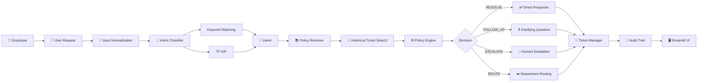
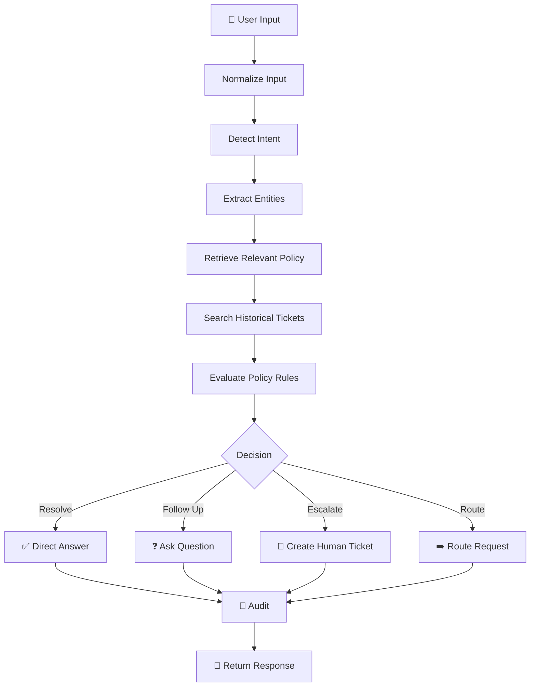
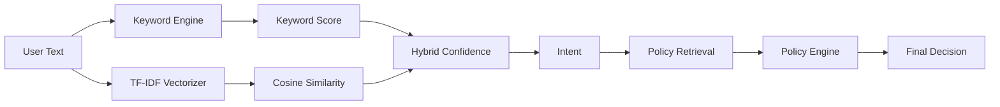
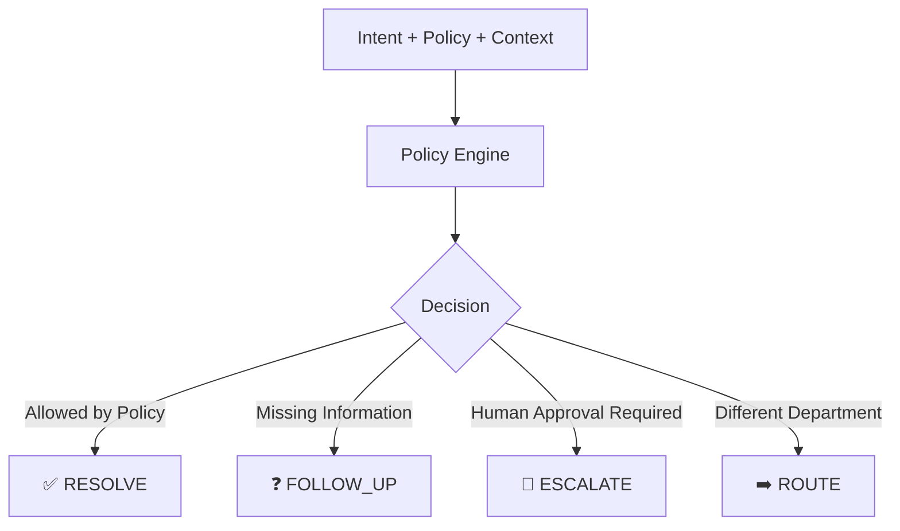
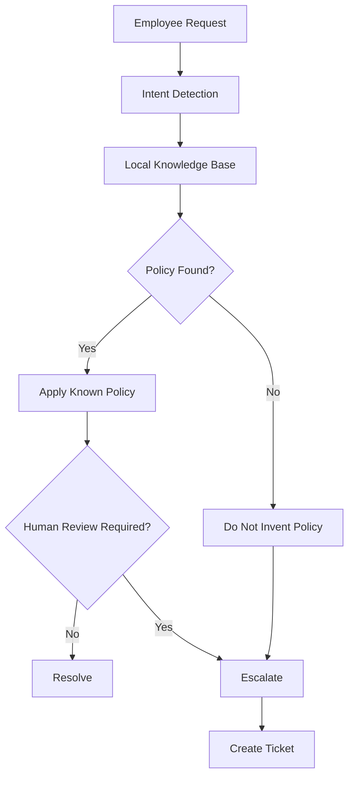
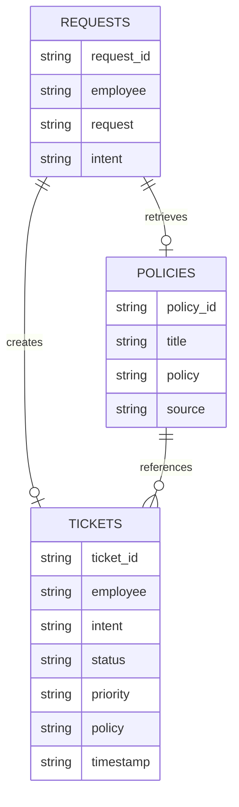
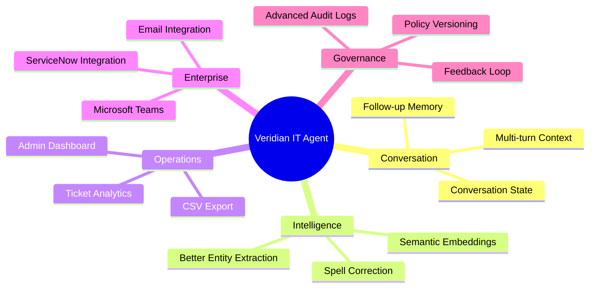

# 🛡️ Veridian IT Service Agent

### Agentic AI Factory Internship — Assignment 2

**Internal IT Support Service Agent**

> A deterministic, policy-aware IT support agent designed for **Veridian Corp** that understands employee requests, retrieves relevant IT policies, makes explainable decisions, creates traceable tickets, and maintains a complete audit trail — **fully locally, without an LLM or external API dependency.**

LIVE LINK : https://veridian-it-agent.streamlit.app 

**Author:** Akash Singh Sagar

---

## 🚀 Overview

Veridian Corp's IT helpdesk receives numerous employee requests every day — password issues, VPN problems, software installation requests, laptop replacements, security incidents, and more.

Many of these requests are repetitive and governed by predefined policies.

The **Veridian IT Service Agent** automates this workflow using a deterministic AI/NLP pipeline.

It can:

* 🧠 Understand natural-language IT requests
* 🎯 Classify the user's intent
* 📚 Retrieve the relevant company policy
* 🔎 Search historical tickets for context
* ⚙️ Apply deterministic business rules
* 💬 Ask follow-up questions when information is missing
* 🎫 Create IT support tickets when required
* 🚨 Escalate security-sensitive or approval-based requests
* 🧾 Maintain a complete audit trail
* 🛡️ Prevent policy hallucination

> **No LLM. No API keys. No external AI services. No internet dependency.**

---

# ✨ Key Features

| Feature                     | Description                                      |
| --------------------------- | ------------------------------------------------ |
| 🧠 Intent Detection         | Hybrid TF-IDF + keyword-based classification     |
| 📚 Policy Retrieval         | Finds relevant policies using cosine similarity  |
| ⚙️ Decision Engine          | Deterministic rule-based policy evaluation       |
| 🎫 Ticket Management        | Creates and tracks support tickets               |
| 🔎 Ticket Search            | Finds related historical requests                |
| 🧾 Audit Trail              | Records every major agent action                 |
| 🛡️ No-Hallucination Design | Responses are generated only from known policies |
| 🚨 Security Escalation      | Security incidents are automatically escalated   |
| 💻 Local Execution          | Runs completely on the local machine             |
| 🎨 Streamlit UI             | Simple interactive web interface                 |

---

# 🏗️ System Architecture



---

# 🔄 Agent Workflow

The agent follows a deterministic pipeline from the initial request to the final response.



### Pipeline

```text
USER REQUEST
     │
     ▼
Normalize Input
     │
     ▼
Intent Detection
     │
     ├── Keyword Matching
     └── TF-IDF Similarity
     │
     ▼
Entity Extraction
     │
     ▼
Policy Retrieval
     │
     ▼
Historical Ticket Search
     │
     ▼
Deterministic Policy Engine
     │
     ▼
┌───────────────────────────────────┐
│             DECISION              │
├─────────────┬─────────────────────┤
│ RESOLVE     │ Direct answer       │
│ FOLLOW_UP   │ Ask for information │
│ ESCALATE    │ Human review        │
│ ROUTE       │ Department routing  │
└─────────────┴─────────────────────┘
     │
     ▼
Ticket / Response
     │
     ▼
Audit Trail
     │
     ▼
Streamlit Interface
```

---

# 🧠 Intelligence Pipeline

The project does not rely on a generative LLM.

Instead, it combines several deterministic components:



### Intent Classification

The classifier uses a hybrid approach:

**1. Keyword matching**

Curated keywords are associated with each supported intent.

**2. TF-IDF similarity**

The input is converted into a TF-IDF vector and compared against the intent corpus.

**3. Confidence blending**

Keyword matches receive priority while TF-IDF similarity provides additional classification support.

---

# 🎯 Supported Intents

The agent currently supports:

```text
password_reset
vpn_access
laptop_replacement
software_installation
printer
mailbox
guest_wifi
expense_software
security_incident
wfh_equipment
admin_access
unknown
```

---

# 📚 Policy Retrieval

Policies are stored locally in:

```text
data/policies.json
```

The retriever uses **cosine similarity** to identify the most relevant policy.

Example:

```python
retrieve_policy(
    "My VPN stopped working, credentials expired"
)
```

Possible result:

```json
{
    "policy_id": "KB-02",
    "title": "VPN Access",
    "similarity": 0.87,
    "policy": "VPN access is granted automatically to...",
    "source": "Knowledge Base / Policies"
}
```

### Similarity Threshold

```text
Threshold = 0.08
```

If the similarity score is below the threshold, the system returns:

```text
policy_id: None
```

This prevents the system from pretending that an unrelated policy exists.

---

# ⚙️ Decision Engine

The policy engine converts the detected intent and retrieved context into one of four deterministic decisions.



| Decision    | Meaning                         | Ticket |
| ----------- | ------------------------------- | ------ |
| `RESOLVE`   | Policy allows direct resolution | ❌      |
| `FOLLOW_UP` | More information is required    | ❌      |
| `ESCALATE`  | Human review/approval required  | ✅      |
| `ROUTE`     | Request belongs elsewhere       | ❌      |

---

# 🎫 Ticket Management

The system separates historical tickets from newly created tickets.

### Historical Tickets

Located in:

```text
data/tickets.json
```

These are **read-only**.

### New Session Tickets

New tickets are stored in:

```text
data/tickets_session.json
```

Ticket IDs begin from:

```text
IT-1101
```

This prevents collisions with historical ticket IDs.

Each ticket can contain:

```text
Employee
Intent
Summary
Status
Priority
Policy
Reason
Timestamp
```

---

# 🧾 Audit Trail

Every request generates a traceable audit trail.

Example:

```text
12:30:01  REQUEST_RECEIVED
12:30:01  INPUT_NORMALIZED
12:30:01  INTENT_DETECTED: vpn_access
12:30:01  POLICY_RETRIEVED: KB-02
12:30:01  TICKETS_SEARCHED: 2 related tickets
12:30:01  POLICY_EVALUATED
12:30:01  DECISION_MADE: RESOLVE
12:30:01  TICKET_SKIPPED
12:30:01  RESPONSE_GENERATED
```

This makes the agent's reasoning **traceable and auditable**.

---

# 🛡️ Safety & No-Hallucination Architecture

One of the main design goals is to ensure that the agent does not invent company policies or procedures.



### Safety principles

* Policies are loaded only from `data/policies.json`
* Responses use deterministic templates
* Unknown policies are never invented
* Missing policies result in explicit escalation
* Security incidents are always escalated
* Historical tickets are never modified
* Policy conflicts are surfaced instead of silently resolved
* Approval-based actions require human intervention

---

# 📊 Data Architecture



---

# 🗂️ Data Sources

All data comes exclusively from the supplied Veridian Corp JSON files.

| File                 | Description                  |
| -------------------- | ---------------------------- |
| `data/policies.json` | 11 IT policies               |
| `data/requests.json` | 15 employee support requests |
| `data/tickets.json`  | 10 historical IT tickets     |

### Policy Coverage

```text
KB-01 → Password / Account
KB-02 → VPN Access
KB-03 → Laptop Replacement
...
ASSET-MGMT → Asset Management
```

---

# 🛠️ Technology Stack

| Layer           | Technology                 |
| --------------- | -------------------------- |
| Frontend        | Streamlit                  |
| Language        | Python 3.10+               |
| NLP             | scikit-learn               |
| Classification  | TF-IDF + Keywords          |
| Similarity      | Cosine Similarity          |
| Decision Engine | Deterministic Python Rules |
| Data Storage    | JSON                       |
| Testing         | pytest                     |
| Deployment      | Streamlit Community Cloud  |

### Architecture Principle

```text
No LLM
   │
   ├── No External AI API
   │
   ├── No API Key
   │
   ├── No Internet Dependency
   │
   └── Fully Local Processing
```

---

# 📁 Project Structure

```text
veridian-it-agen/
│
├── 📄 app.py
├── 📄 requirements.txt
├── 📄 README.md
├── 📄 .gitignore
│
├── 📂 agent/
│   ├── __init__.py
│   ├── classifier.py
│   ├── retriever.py
│   ├── policy_engine.py
│   ├── orchestrator.py
│   ├── ticket_manager.py
│   └── audit.py
│
├── 📂 data/
│   ├── policies.json
│   ├── requests.json
│   ├── tickets.json
│   └── tickets_session.json
│
└── 📂 tests/
    └── test_agent.py
```

---

# 💻 Installation

## Requirements

* Python **3.10+**
* pip
* Git

### 1. Clone the repository

```bash
git clone https://github.com/akashsinghsagar/veridian-it-agent.git
```

### 2. Enter the project

```bash
cd veridian-it-agent
```

### 3. Create a virtual environment

```bash
python -m venv .venv
```

### 4. Activate the environment

**Windows**

```bash
.venv\Scripts\activate
```

**Linux / macOS**

```bash
source .venv/bin/activate
```

### 5. Install dependencies

```bash
pip install -r requirements.txt
```

---

# ▶️ Run the Application

Start the Streamlit application:

```bash
streamlit run app.py
```

The application will be available at:

```text
http://localhost:8501
```

---

# 🧪 Testing

Run the complete test suite:

```bash
pytest -q
```

Expected:

```text
35+ tests passed
```

Tests cover:

* Data validation
* Policy validation
* Historical tickets
* All 15 employee requests
* Direct user queries
* Intent classification
* Policy retrieval
* Decision engine
* Ticket creation
* No-ticket scenarios
* No-hallucination behavior
* Audit trail generation
* Historical ticket immutability

---

# 🎬 Demo Scenarios

| # | Scenario                          | Expected Decision |
| - | --------------------------------- | ----------------- |
| 1 | Password lockout after 6 attempts | `ESCALATE`        |
| 2 | Guest Wi-Fi request               | `RESOLVE`         |
| 3 | VPN credentials expired           | `RESOLVE`         |
| 4 | Non-catalog software              | `ESCALATE`        |
| 5 | Phishing email                    | `ESCALATE`        |
| 6 | WFH monitor request               | `RESOLVE`         |
| 7 | Unknown request                   | `FOLLOW_UP`       |
| 8 | Admin access request              | `ESCALATE`        |

---

# 🔍 Example Request

### User

```text
My VPN stopped working because my credentials expired.
```

### Agent Pipeline

```text
Input
  ↓
Intent: vpn_access
  ↓
Policy: KB-02
  ↓
Similarity: 0.87
  ↓
Policy Evaluation
  ↓
Decision: RESOLVE
  ↓
Generate Response
  ↓
Audit Event
```

### Result

```text
Decision: RESOLVE

Policy: KB-02 — VPN Access

The employee can renew their VPN credentials
according to the VPN access policy.

Ticket Required: No
```

---

# 🚀 Deployment

The application can be deployed using **Streamlit Community Cloud**.

### Steps

1. Push the repository to GitHub
2. Open Streamlit Community Cloud
3. Connect the GitHub repository
4. Select:

```text
app.py
```

5. Deploy

No API keys or environment variables are required.

The application uses relative paths:

```python
Path(__file__).resolve().parent / "data"
```

Therefore, the project can run across different operating systems and deployment environments.

---

# ⚠️ Limitations

The current implementation has some intentional limitations:

* Keyword/TF-IDF classification may struggle with highly ambiguous requests
* Session-created tickets are not fully persistent across Streamlit restarts
* Policy updates require modifying `policies.json`
* Follow-up conversations are not yet stateful
* No enterprise ITSM integration
* No advanced semantic embeddings

These limitations are opportunities for future development rather than dependencies of the core architecture.

---

# 🔮 Future Improvements



Planned improvements:

* 💬 Multi-turn conversational state
* 🧠 Semantic embeddings
* ✍️ Spell correction
* 📈 Ticket analytics dashboard
* 📊 CSV ticket export
* 🔗 ServiceNow integration
* 📧 Email integration
* 💬 Microsoft Teams integration
* 🔄 Policy versioning
* 🧪 Continuous evaluation and feedback loops

---

# 🎯 Design Philosophy

The project follows four core principles:

```text
┌────────────────────────────────────┐
│         VERIDIAN PRINCIPLES        │
├────────────────────────────────────┤
│                                    │
│  🛡️  SAFETY                       │
│      Never invent a policy         │
│                                    │
│  🔍  TRACEABILITY                  │
│      Every decision is auditable   │
│                                    │
│  ⚙️  DETERMINISM                  │
│      Same input → predictable      │
│      policy-driven outcome         │
│                                    │
│  👤  HUMAN OVERSIGHT               │
│      Sensitive actions require     │
│      human intervention            │
│                                    │
└────────────────────────────────────┘
```

---

# 👨‍💻 Author

### Akash Singh Sagar

**Veridian IT Service Agent**

Built as part of the **AIONOS Agentic AI Factory Internship Assessment — Assignment 2**.

---

## 📌 Project Summary

```text
                    ┌───────────────────┐
                    │   Employee        │
                    │     Request       │
                    └─────────┬─────────┘
                              │
                              ▼
                    ┌───────────────────┐
                    │ Intent Classifier │
                    └─────────┬─────────┘
                              │
                              ▼
                    ┌───────────────────┐
                    │ Policy Retriever  │
                    └─────────┬─────────┘
                              │
                              ▼
                    ┌───────────────────┐
                    │  Policy Engine    │
                    └─────────┬─────────┘
                              │
              ┌───────────────┼───────────────┐
              ▼               ▼               ▼
          RESOLVE         FOLLOW_UP       ESCALATE
              │               │               │
              └───────────────┼───────────────┘
                              ▼
                    ┌───────────────────┐
                    │   Audit Trail     │
                    └───────────────────┘
```

### Built with ❤️ using Python, Streamlit & scikit-learn

**© 2026 Akash Singh Sagar**
